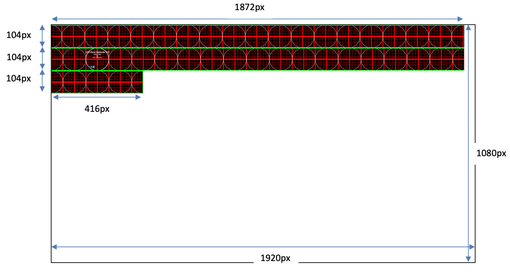

# recut

Prepares content for the LED banner by slicing a 4160×104 image (or video frame) into three strips and composing them onto a 1920×1080 canvas. Video output is re-encoded with H.264; requires `ffmpeg` on your PATH.

Multiple inputs are placed side by side, each filling an equal slot of the 4160px width — so two 2080×104 inputs, four 1040×104 inputs, etc. The number of inputs must evenly divide 4160. Each input may be smaller than its slot as long as its width evenly divides the slot width and its height evenly divides 104; it is tiled to fill the slot. For videos with different lengths, shorter inputs freeze on their last frame.



```
python3 -m venv .venv
source .venv/bin/activate
pip install -r requirements.txt
python3 recut.py <input> [input2 ...]
```
